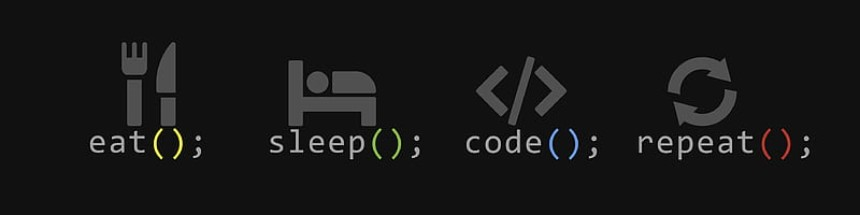

# Hello 👋 i'm Aymen Hmid

***About me***

Hello! I'm Aymen Hmid, an enthusiastic Software Engineer with a keen interest in AI and its applications. I'm dedicated to delivering top-notch solutions and thrive on challenges. Let's connect and explore potential collaborations!

***Connect with me***

***🛠  Tech Stack***

***Github Stats***

